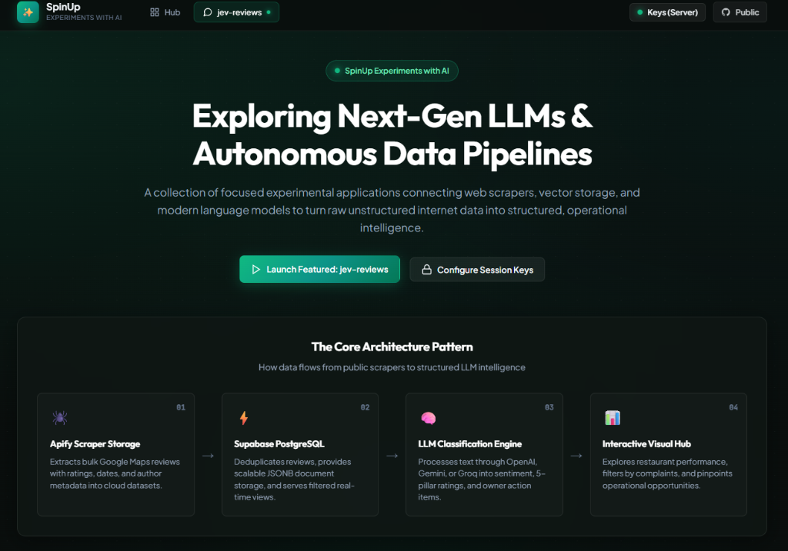
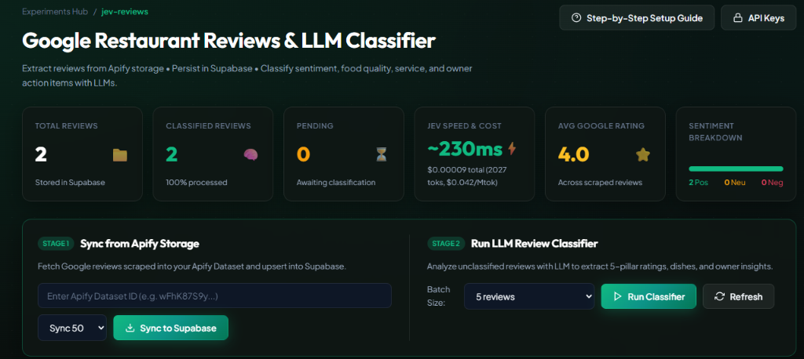

# SpinUp Experiments with AI

A high-performance, dark-themed web application built with **Astro 5** and **TypeScript** to showcase bleeding-edge AI models, scrapers, and operational intelligence pipelines.

The flagship experiment in this workspace is **`jev-reviews`**: an automated pipeline that ingests Google Maps restaurant reviews from **Apify Storage**, stores and deduplicates them in **Supabase PostgreSQL**, and classifies them using **Jev (TypeSafe System One)** or traditional generative LLMs across 5 operational pillars, extracting dishes, customer highlights, and owner recommendations.

---

## Application Previews (Localhost)

### 1. SpinUp Experiments with AI Hub
*Landing hub showcasing autonomous pipelines, scraper storage, and model playgrounds:*



### 2. Google Reviews Scrapes & Jev Classifier Dashboard
*Real-time pipeline with Apify sync, Supabase storage, live Jev Speed & Cost KPI cards (~230ms • $0.042/Mtok), and batch classification:*



---

## Supported AI Models

The classifier supports multiple AI backends, with **Jev** as the primary recommended engine:

1. **Jev / TypeSafe System One (Recommended)**:
   - **Why Jev?** Jev doesn't generate creative text; it evaluates typed questions directly over state in a single forward pass.
   - **3 Core Primitives**:
     - **Choice**: Categorical decisions (e.g. `positive`, `neutral`, `negative` sentiment).
     - **Score**: Quantitative ratings on a scale (e.g. 1 to 5 for Food Quality, Service, Cleanliness, Atmosphere, Value).
     - **Noul**: Probability of truth / likelihood (e.g. `recommends`, `has_complaints`, `has_praise`).
   - **Speed**: Single-pass evaluation (~95ms – 365ms live response time, 5x–10x faster than generative LLMs).
   - **Cost**: **$0.042 / million input tokens** ($42 / billion tokens) and **$0 / output tokens**. A typical review classification costs ~$0.00002 to $0.00004!
   - **Endpoint**: `POST https://api.typesafe.ai/v1/systemone`
   - **Model Alias**: `jev-latest`
   - **Key**: `JEV_API_KEY`

2. **OpenAI**:
   - Models: `gpt-4o-mini` (default), `gpt-4o`.
   - Key: `LLM_API_KEY`.

3. **Google Gemini**:
   - Models: `gemini-2.5-flash`, `gemini-1.5-flash`.
   - Key: `LLM_API_KEY`.

4. **Groq**:
   - Models: `llama-3.3-70b-versatile` (fast sub-second open-weights inference).
   - Key: `LLM_API_KEY`.

---

## Key Features

- **Dual View Modes (Cards & Operational Score Matrix Table)**:
  - **Cards View**: Beautiful glassmorphic cards with sentiment badges, mini-score strips (`🍽️ Food: 5/5`, `🛎️ Svc: 5/5`, `✨ Clean: -`, `🕯️ Atmo: 1/5`, `💵 Val: -`), and Jev telemetry tags.
  - **Score Matrix Table View**: Dense operational table displaying Restaurant, Google Rating, Sentiment, Score, Food, Service, Cleanliness, Atmosphere, Value, and Jev Inference latency/cost side-by-side in columns.
- **Real-Time Jev Speed & Cost KPI**:
  - Live KPI metric showing aggregate average latency (~230ms) and exact cumulative token costs ($0.042/Mtok).
- **Apify Storage Ingestion**:
  - Seamlessly pulls from Apify Google Maps Scrapers (e.g. `compass/crawler-google-places`).
  - Automatically unrolls reviews from both flat review datasets and nested place records.
- **Supabase Storage & Deduplication**:
  - PostgreSQL storage with JSONB columns for classifications, automated indexes, RLS policies, and summary stats.
- **Deep Inspection Drawer**:
  - Deep-dive into any review to inspect 5-pillar scores with qualitative notes, dish lists, action items for restaurant owners, and Jev System One question-level confidence and probability breakdowns.
- **Zero-Leak Security Architecture**:
  - Repository is safe for public GitHub publishing.
  - `.gitignore` strictly protects `.env`.
  - In-browser session management (`sessionStorage`) allows setting keys per browser session with zero disk writes.

---

## Quickstart

### 1. Install Dependencies
```bash
npm install
```

### 2. Configure Environment Variables
Copy `.env.example` to `.env`:
```bash
cp .env.example .env
```

Open `.env` and fill in your credentials:
```env
# Apify Scraper
APIFY_API_TOKEN=your_apify_token_here
APIFY_DEFAULT_DATASET_ID=your_dataset_id_here

# Supabase Database
SUPABASE_URL=https://your-project.supabase.co
SUPABASE_SERVICE_ROLE_KEY=your-supabase-service-role-key
SUPABASE_ANON_KEY=your-supabase-anon-key

# Jev AI (Recommended)
LLM_PROVIDER=jev
LLM_MODEL=jev-latest
JEV_API_KEY=your_typesafe_jev_key_here
```

*(Note: `.env` is ignored by git and will never be committed to your public repository).*

Alternatively, launch the app and click the **"API Keys"** button in the top navigation bar to enter keys strictly in browser memory (`sessionStorage`) without touching the `.env` file.

### 3. Launch Development Server
```bash
npm run dev
```

Open [http://localhost:4321/jev-reviews](http://localhost:4321/jev-reviews) in your browser.

---

## Step-by-Step Integration Guide

For full step-by-step guidance on running the Apify Google Scraper, running the Supabase SQL schema migration, and testing classification with Jev:

👉 **[SETUP_GUIDE.md](./SETUP_GUIDE.md)**

---

## Project Structure

```
jev-reviews/
├── supabase/
│   └── schema.sql                 # Supabase PostgreSQL schema and migration
├── src/
│   ├── components/
│   │   ├── Header.astro           # Top navigation bar with active session badge
│   │   └── KeySettingsModal.astro     # In-memory browser session credentials modal
│   ├── layouts/
│   │   └── Layout.astro           # Master HTML layout and footer
│   ├── lib/
│   │   ├── apify.ts               # Apify client and review dataset normalizer
│   │   ├── env.ts                 # Dynamic environment variable resolver with override
│   │   ├── llm.ts                 # Multi-model classification engine (Jev, OpenAI, Gemini, Groq)
│   │   ├── supabase.ts            # Supabase client and database queries
│   │   └── types.ts               # TypeScript interfaces and Jev telemetry types
│   ├── pages/
│   │   ├── api/
│   │   │   ├── apify/sync.ts      # Syncs Apify dataset reviews into Supabase
│   │   │   ├── health.ts          # Service health and key detection status
│   │   │   └── reviews/
│   │   │       ├── classify.ts    # Jev / LLM batch classification endpoint
│   │   │       └── list.ts        # Filterable review query & stats endpoint
│   │   ├── index.astro            # SpinUp AI Experiments Hub
│   │   └── jev-reviews.astro      # Main reviews dashboard (Cards & Table Matrix)
│   └── styles/
│       └── global.css             # Design tokens, green-grey palette & glassmorphism
├── .env.example                   # Safe environment variable template
├── .gitignore                     # Strict secrets and build artifact exclusions
├── astro.config.mjs               # Astro SSR configuration with Node adapter
├── package.json
└── tsconfig.json
```

---

## License
MIT
